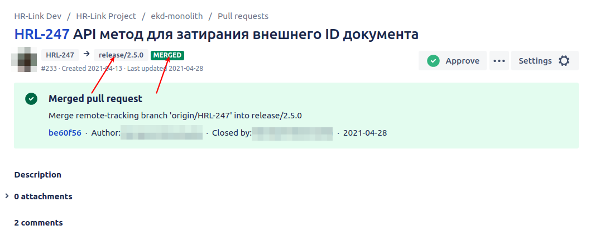

## Git Rule: Разрешение конфликтов при релизе


Во время релиза последовательно сливаются в релизную ветку все задачи, которые в него входят. Если во время слития произошёл конфликт, то решать его необходимо разработчику, чья задача не была успешно слита в релизную ветку. В таких ситуациях разработчика уведомляют и отправляют ссылку на соответствующий pull request. Для его разрешения следует воспользоваться шагами ниже. 


1. Переключиться в своём локальном git-репозитории проекта на релизную ветку задачи. Имя ветки можно найти в pull request'е ветки сливаемой в релизную ветку задачи или можно уточнить у коллег. На скриншоте в конце текущей страницы стрелкой указано, где можно найти релизную версию в UI pull request'а bitbucket'а.

2. Выполнить `git pull`, так как релизная ветка могла обновиться. Этот пункт особенно важен, когда при релизе необходимо неоднократно решать конфликты.

3. Выполнить `git merge origin/HRL-XXX`, где ```HRL-XXX``` - это номер задачи, которая сливается в релизную ветку.

4. Разрешить конфликт.
   - Разрешить конфликт - значит сделать так, чтобы не было не только конфликта, но и ошибок в коде. То есть нужно понять, почему конфликт произошёл, и какая должна быть версия кода после слития.
   - Версию всегда выбирать релизную, а не той задачи, которая сливается. То есть версия сливаемой задачи вообще не влияет на версию в релизной ветке.
   - Бывает так, что у разработчика нет возможности самостоятельно разрешить конфликт, например ему может потребоваться понимание логики других задач. Стоит смело обращаться к коллегам.
   - Разрешение конфликтов не проходит ревью, поэтому стоит особенно осторожно и внимательно подходить к нему.

5. Перед коммитом обязательно нужно проверить, что все необходимые изменения в него попадают:
   ```
   git status
   ```
   Если предыдущая команда показала, что что-то не добавлено в будущий коммит слития, то добавить все изменения можно следующей командой:
   ```
   git add .
   ```

6. Коммитим с commit-message'ем по умолчанию:
   ```
   git commit
   ```

7. Если конфликт был сложный, то имеет смысл проверить, что результат как минимум компилируется, а по-хорошему - проходит соответствующие тесты.

8. Запушить коммит слития в релизную ветку.

9. Проверить в UI pull request'а (в bitbucket'е или github'е), что ветка была успешно слита. На скриншоте ниже стрелкой указано, как в UI bitbucket'а отображается успешное слитие.

10. Уведомить человека, который попросил разрешить конфликт.


Скриншот для наглядного представления UI bitbucket'а после успешного слития ветки в релизную ветку:



