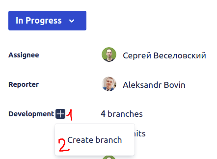

## Jira Rule 2: Начало задачи

1. Перевести задачу в `In Progress`. Поле `Developer` должно автоматически заполниться, там будете вы.
2. Создать ветку, выполнив клик по `Development` → `Create branch`.

   
   
   Откроется страница создания ветки в `Bitbucket`, на ней необходимо сделать следующее:
   - Выбрать репозиторий, в котором нужно создать ветку.
   - Ветка, от которой делается новая ветка по умолчанию будет установлена как `master`, менять не нужно.
   - Имя новой ветки должно состоять только из ключа задачи. Например, `HRL-255`.
3. При необходимости создания веток в других репозиториях повторить п.2.
4. Выполнить `git fetch` в среде разработки.
5. В нужных модулях переключиться на ветки задачи `git checkout <название ветки>`. Например, `git checkout HRL-255`.
6. Выполнить [первый коммит](../git/gr01_task-first-commit.md) в каждой созданной ветке.
